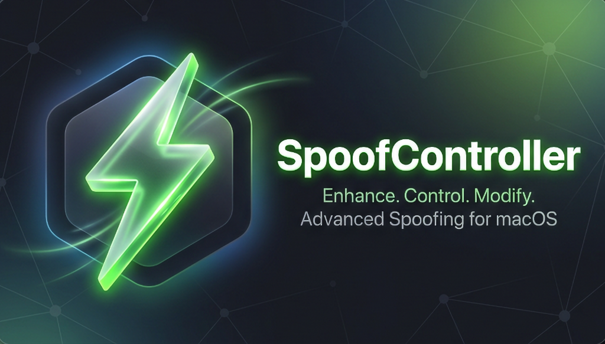

<p align="center">
  
</p>

# SpoofController v1.1.2 ⚡️

<p align="center">
  <a href="#english">English</a> • <a href="#russian">Русский</a>
</p>

---

<a name="english"></a>
## English 🇺🇸
### Professional macOS GUI for `spoofdpi` — Bypass DPI & Remove Throttling

**SpoofController** is a lightweight, high-performance macOS application built to bypass DPI censorship, unblock websites, and remove ISP throttling.

> Love sharing internet from your phone but hate it when your ISP throttles the speed? Many solutions have been tried over the years. This one is simply convenient for Mac users. If you're on Windows... well, my condolences. 😉

It is a **GoodbyeDPI Mac alternative** that restores access to YouTube and blocked resources without speed loss. No terminal or command line knowledge required.

### Features
- **Control**: Start/stop from Menu Bar.
- **Status**: Visual indicator (🟢/🔴).
- **Auto-Install**: Handles `spoofdpi` dependency via Homebrew.
- **Ultra-Lightweight**: Zero-log silent operation for 0.1% CPU and minimal RAM usage.
- **Clean State**: Automatically kills orphan processes to prevent conflicts.
- **Advanced Settings**: Configure TTL and Window Size values for specialized bypass scenarios.

### Setup
1. **Download**: Get `.dmg` from [Releases](https://github.com/iddictive/SpoofController/releases).
2. **Install**: Drag to `Applications`.
3. **Run**: Opens with auto-setup.

### VPN Compatibility
To use SpoofController alongside a VPN (like Shadowrocket, AdGuard, etc.):
1. **Disable `Use system-wide proxy`** in SpoofController Settings.
2. Configure your VPN to use `127.0.0.1:8080` (or your custom port) as the **upstream (parent) proxy**.
3. This allows the VPN to handle routing while SpoofController handles DPI bypassing.

### Uninstall
```bash
curl -sL https://raw.githubusercontent.com/iddictive/SpoofController/main/scripts/uninstall.sh | bash
```

---

<a name="russian"></a>
## Русский 🇷🇺
### Нативный GUI для `spoofdpi` — Обход DPI и снятие ограничений скорости

**SpoofController** — легкое и производительное приложение для macOS на базе `spoofdpi`, которое обходит блокировки провайдеров (DPI) и убирает замедление трафика. 

> Любите раздавать интернет с телефона, но провайдер режет скорость? Давно было много разных решений, но это — просто удобное для тех, у кого Mac. Для тех, у кого Windows — соболезную. 😉

**Альтернатива GoodbyeDPI для Mac**, возвращает доступ к YouTube и заблокированным ресурсам одним кликом. Работает без терминала.

### Возможности
- **Управление**: Старт/стоп из менюбара.
- **Статус**: Цветной индикатор (🟢/🔴).
- **Авто-установка**: Сам проверит и поставит `spoofdpi`.
- **Максимальная легкость**: Работает бесшумно без записи логов, потребляя ~0.1% CPU и минимум RAM.
- **Чистый запуск**: Автоматически завершает старые процессы `spoofdpi` для избежания конфликтов.
- **Расширенные настройки**: Установка значений TTL и Window Size для специфических сценариев обхода.

### Установка
1. **Скачать**: `.dmg` со страницы [Релизов](https://github.com/iddictive/SpoofController/releases).
2. **Установить**: Перетянуть в `Applications`.
3. **Запуск**: Готов к работе сразу.

### Совместимость с VPN
Чтобы использовать SpoofController вместе с VPN (Shadowrocket, AdGuard и т.д.):
1. **Отключите `Использовать системный прокси`** в настройках SpoofController.
2. В самом VPN-клиенте укажите `127.0.0.1:8080` (или ваш порт) в качестве **родительского (upstream) прокси**.
3. Таким образом VPN будет отвечать за маршрутизацию, а SpoofController — за обход DPI.

### Удаление
```bash
curl -sL https://raw.githubusercontent.com/iddictive/SpoofController/main/scripts/uninstall.sh | bash
```

---
MIT License.
